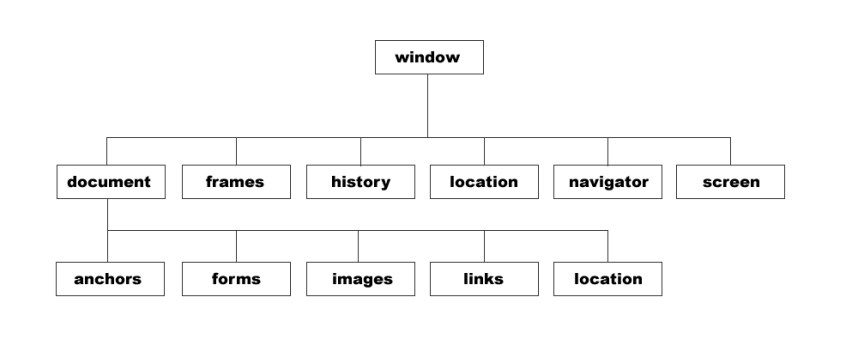
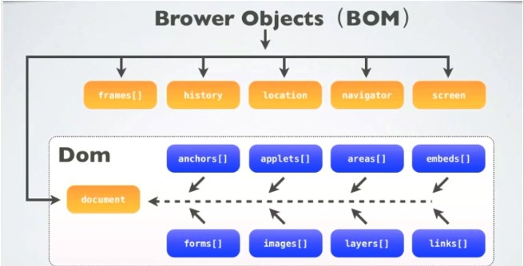

# javascript 入门

[3.5 如何调试](#3.5)

## javascript 简介
#### [语言概述](https://zh.wikipedia.org/zh-cn/JavaScript)
- javascript 是一种支持动态类型, 基于原型的直译式语言(不用编译, 直接运行)
- javascript 最早在HTML网页使用, 浏览器内置javascript引擎, 解析网页中的 javascript, 给HTML网页增加动态功能.
- 现在它也可被用于web服务器端, 如Node.js.


[点击跳转一](#jump)

#### [诞生历史](http://javascript.ruanyifeng.com/introduction/history.html)
- 1992年底美国国家超级电脑应用中心(NCSA)开发了人类历史上第一个浏览器Mosaic.
- Netscape 在Mosaic基础上开发新一代浏览器, 1994年12月发布了Netscape Navigator1.0版
- 1995年12月4日,Netscape公司与Sun公司联合发布了JavaScript语言
- 1996年3月,Navigator 2.0浏览器正式内置了JavaScript脚本语言
- 1997年7月,ECMAScript 1.0发布, 它和 javascript的关系是: 前者是后者的规格,后者是前者的一种实现

[点击跳转二](#md-anchor)

<span id="jump">跳转到的地方一</span>

#### 应用前景
- 随着语言的广泛应用, javascript 现在不只在 web 前端, 还涉及其他领域 eg. web 后端, Hybrid App, ...

## 简明教程
- 本教程分为入门, 中级, 高级, 这只是一个建议的学习顺序, 但也不要拘泥于此

<a name="md-anchor" id="md-anchor">跳转到的地方二</a>

### 入门教程

#### 1.如何在 html 中嵌入 javascript
- 方式一: 在 script 标签之间写 javascript 代码

  特点: 简单明了
``` javascript
<script type="text/javascript">
    var tableWidget_tableCounter = 0;
    //...
</script>
```
- 方式二: 通过 script 标签的 src 属性导入独立的 js 文件

  特点: 控制逻辑 和 web 文档分类, 结构清晰
``` javascript
<script type="text/javascript" src="./lib/table_sort_tool.js"> </script>
```

#### 2.[如何定义变量](http://www.liaoxuefeng.com/wiki/001434446689867b27157e896e74d51a89c25cc8b43bdb3000/001434499190108eec0bdf14e704a09935cd112e501e31a000)
- 通过 var来定义变量:
  eg. `var tableWidget_tableCounter = 0;`
- 命名规则: 只能使用 数字, 字母, `_, $`, 且不能用数字开头

#### 3.[如何定义函数](http://www.liaoxuefeng.com/wiki/001434446689867b27157e896e74d51a89c25cc8b43bdb3000/00143449926746982f181557d9b423f819e89709feabdb4000)
- 方式一: 普通函数
``` javascript
    function sortString(a, b) {
      if ( a.toUpperCase() < b.toUpperCase() ) return -1;
      if ( a.toUpperCase() > b.toUpperCase() ) return 1;
      return 0;
    }
```
- 方式二: 匿名函数
``` javascript
    /* 注册 window.onload 事件处理函数 */
    window.onload = function () {
        addLoadEvent(preparePreview());
        addLoadEvent(prepareReadJSON());
        addLoadEvent(prepareSaveJSON());
        addLoadEvent(initTableWidget('myTable',500,600,Array('S','N',false,'N','S')));
    };
```
<h2 id="3.5">添加注释</h2>

#### 4.如何添加注释
- 方式一: 使用 `//`,   eg. `//全局变量`
- 方式二: 使用　`/**/`, eg. `/* 注册 window.onload 事件处理函数 */`

#### 5.如何调试
- 通过打印信息调试:  eg.使用 `alert(), console.log()`
- 通过[chrome 开发者工具调试](http://www.cnblogs.com/constantince/category/712675.html)

#### 6.javascript 的执行过程
相信大家第一次在 html 中看到前后有多个 `script` 标签时都会对它的执行顺序感到迷惑, 这么多`script `标签, 到底如何运行啊 !

- 按代码块块执行代码, 所谓代码块就是使用`script`标签分隔的代码段
- 浏览器在解析html文档流的时候, 如果遇到一个`script`标签, 则js会等到这个代码块都加载完之后再对代码进行预编译, 然后再执行.

  执行完毕后,浏览器会继续解析其余的 html 文档, 同时js也准备好处理下一个代码块

- 不同块都属于一个全局作用域, 所以块之间的变量和函数是可以共享的
- 为了安全起见, 一般在页面初始化完毕之后才允许js代码执行, 这样就可以避免一些网速对js执行的影响. 同时,也避开了html文档流对js执行的限制

### 中级教程

#### 1.数据类型

- [number, bool], [字符串], 和 c语言类似

- [数组]

``` javascript
//写法一 使用　new Array
var tableWidget_arraySort = new Array();
var mycars=new Array("Saab","Volvo","BMW");
//写法二 用 '[...]' 表示
var t_name = ["Name", "Age", "Position", "Income", "Gender"];
```
- [对象]

``` javascript
//表示方式: '{}'
var e_info = {};
var xiaoming = {
    name: '小明',
    birth: 1990,
    middle-school: 'No.1 Middle School',
    height: 1.70,
    weight: 65,
    score: null
};
//访问方式: `, 和 []`
xiaoming.name
xiaoming['name'];
xiaoming['middle-school'];

//动态添加, 删除属性
xiaoming.age = 18; delete xiaoming.age;
```

- [Map, Set]
  - Map是一组键值对的结构,可以视为其他语言中的Map或Dictionary的数据结构, 具有极快的查找速度
  - Set和Map类似,也是一组key的集合,但不存储value。由于key不能重复,所以,在Set中,没有重复的key

#### 2.控制结构

- [条件判断]
  - if ... else　...

- [循环]
  - for: 通过初始条件、结束条件和递增条件来循环执行语句块, 应用: 遍历数组
  - for ... in: eg. 遍历数组, 对象
  - for...of: eg. 遍历 [iterable] 类型
  - while,　do...while

#### 3.函数
前面提过函数的定义, 此处不再赘余, 这里提一些函数的其他用法

- [高阶函数] : 一个函数就可以接收另一个函数作为参数,这种函数就称之为高阶函数
  -

``` javascript
function add(x, y, f) {
    return f(x) + f(y);
}
x = -5;
y = 6;
f = Math.abs;
f(x) + f(y) ==> Math.abs(-5) + Math.abs(6) ==> 11;
return 11;

```
- 数组支持的高阶函数: [map/reduce], [filter], [sort]

- [闭包]

在下面这个例子中, 我们在函数lazy_sum中又定义了函数sum, 并且内部函数sum可以引用外部函数lazy_sum的参数和局部变量, 当lazy_sum返回函数sum时, 相关参数和变量都保存在返回的函数中, 这种称为 "闭包(Closure)"
``` javascript
function lazy_sum(arr) {
    var sum = function () {
        return arr.reduce(function (x, y) {
            return x + y;
        });
    }
    return sum;
}
var f = lazy_sum([1, 2, 3, 4, 5]); // function sum()
f(); // 15
```
### 高级教程
#### 1.标准对象
- [JSON]:  全称是 JavaScript Object Notation, 它是一种数据交换格式, 适合在网络上交换数据
  - JSON 和 js对象可以相互转换
  - js对象序列化为 JSON:
   `JSON.stringify(obj,null,' ')
  - JSON反序列化为js对象:
   `JSON.parse('JSONstring')`

- [Date]: Date对象用来表示日期和时间
  - 获取系统当前时间: `var now = new Date();`
  - 创建一个指定日期和时间的Date对象: `var d = new Date(2015, 5, 19, 20, 15, 30, 123);`
  - 通过解析一个符合ISO 8601格式的字符串创建Date对象: `var d = Date.parse('2015-06-24T19:49:22.875+08:00');`

- [RegExp]
  - 正则表达式是用来匹配字符串的, 它的设计思想是用一种描述性的语言来给字符串定义一个规则,凡是符合规则的字符串,我们就认为它“匹配”了.
  - 很多语言都支持正则, 语法格式基本类似. eg. 支持正则的有: 编程语言中的 java,php..., shell命令中的 grep,sed, 以及其他领域 cmake file, ...
  - JavaScript有两种方式创建一个正则表达式

    - 第一种方式是直接通过/正则表达式/写出来
    - 第二种方式是通过 `new RegExp('正则表达式')` 创建一个RegExp对象
``` javascript
    var re1 = /ABC\-001/;
    var re2 = new RegExp('ABC\\-001');

    re1; // /ABC\-001/
    re2; // /ABC\-001/
    //使用正则表达式
    var re = /^\d{3}\-\d{3,8}$/;
    re.test('010-12345'); // true
    re.test('010-1234x'); // false
    re.test('010 12345'); // false
```

#### 2.[面向对象编程]
- [创建对象]
  - 通过`{ ... }`创建对象, 前面已经介绍过
  - 通过构造函数创建对象
``` javascript
function Student(name) {
    this.name = name;
    this.hello = function () {
        alert('Hello, ' + this.name + '!');
    }
}
//注意，如果不写new，这就是一个普通函数，它返回undefined。但是，如果写了new，它就变成了一个构造函数，它绑定的this指向新创建的对象，并默认返回this
var xiaoming = new Student('小明');
xiaoming.name; // '小明'
xiaoming.hello(); // Hello, 小明!
```

- [原型继承]: JavaScript不区分类和实例的概念, 而是通过原型继承来实现面向对象编程. 下面的示例中:
  - xiaoming有自己的name属性,但并没有定义run()方法。不过,由于小明是从Student继承而来,只要Student有run()方法,xiaoming也可以调用
  - JavaScript的原型链和Java的Class区别就在,它没有“Class”的概念,所有对象都是实例,所谓继承关系不过是把一个对象的原型指向另一个对象而已

``` javascript
var robot = {
    name: 'Robot',
    height: 1.6,
    run: function () {
        console.log(this.name + ' is running...');
    }
};
var Student = {
    name: 'Robot',
    height: 1.2,
    run: function () {
        console.log(this.name + ' is running...');
    }
};

var xiaoming = {
    name: '小明'
};

xiaoming.__proto__ = Student;  //原型继承
xiaoming.name; // '小明'
xiaoming.run(); // 小明 is running...
```

- [class 继承]: ES6开始正式引入新关键字: class, extend, 前者用来定义类, 后者用来继承父类
  - class继承和原有的原型继承实际上没有任何区别, class的作用就是让JavaScript引擎去实现原来需要我们自己编写的原型链代码, 简而言之, 用class的好处就是极大地简化了原型链代码
``` javascript
//用 class 定义对象
class Student {
    constructor(name) {
        this.name = name;
    }

    hello() {
        alert('Hello, ' + this.name + '!');
    }
}
//用 extent 定义继承对象
class PrimaryStudent extends Student {
    constructor(name, grade) {
        super(name); // 记得用super调用父类的构造方法!
        this.grade = grade;
    }

    myGrade() {
        alert('I am at grade ' + this.grade);
    }
}
```


#### 3.[ajax]
如果要让用户留在当前页面中, 同时发出新的HTTP请求, 就必须用JavaScript发送这个新请求, 接收到数据后, 再用JavaScript更新页面, 这样一来, 用户就感觉自己仍然停留在当前页面, 但是数据却可以不断地更新, ajax 请求是异步执行的
``` javascript
function success(text) {
    var textarea = document.getElementById('test-response-text');
    textarea.value = text;
}

function fail(code) {
    var textarea = document.getElementById('test-response-text');
    textarea.value = 'Error code: ' + code;
}

var request = new XMLHttpRequest(); // 新建XMLHttpRequest对象

request.onreadystatechange = function () { // 状态发生变化时,函数被回调
    if (request.readyState === 4) { // 成功完成
        // 判断响应结果:
        if (request.status === 200) {
            // 成功,通过responseText拿到响应的文本:
            return success(request.responseText);
        } else {
            // 失败,根据响应码判断失败原因:
            return fail(request.status);
        }
    } else {
        // HTTP请求还在继续...
    }
}

// 发送请求:
request.open('GET', '/api/categories');
request.send();

alert('请求已发送,请等待响应...');
```
#### 4.[jQuery]
**jQuery是什么**

它是javascript世界中使用最广泛的一个库, 它的优势:

- 消除浏览器差异：你不需要自己写冗长的代码来针对不同的浏览器来绑定事件,编写AJAX等代码
- 简洁的操作DOM的方法：写 `$('#test')` 肯定比 `document.getElementById('test')` 来得简洁
- 轻松实现动画、修改CSS等各种操作

**$符号简介**

- $是著名的jQuery符号, 实际上jQuery把所有功能全部封装在一个全局变量jQuery中, 而$也是一个合法的变量名, 它是变量jQuery的别名
``` javascript
window.jQuery; // jQuery(selector, context)
window.$; // jQuery(selector, context)
$ === jQuery; // true
typeof($); // 'function'
```
- $本质上就是一个函数, 但是函数也是对象, 于是$除了可以直接调用外, 也可以有很多其他属性

**选择器简介**

让我们对比 传统DOM操作 和 $选择器操作， 来体验 jQuery 的高效性 !
``` javascript
//按照 id 查找
var a = document.getElementById('dom-id');
var div = $('#dom-id');
//按照 tag 查找
var divs = document.getElementsByTagNames('div');
var ps = $('div');
//除了上述以外, $还可以直接按照属性查找, 组合查找
var email = $('[name=email]');
var emailInput = $('input[name=email]'); // 不会找出`<div name="email">`
```
是不是感觉就会离不开它了

**其他**

除了[选择器], $还可以应用在 [DOM操作], [事件处理], [动画], [ajax封装] 上


## 在 web 前端应用
前端主要和 浏览器, 页面, css 打交道
#### BOM基础


- BOM是Browser Object Model的缩写,即浏览器对象模型, 表示浏览器的功能, 目前关于BOM没有相关标准
- 虽然BOM没有一套标准,但是各个浏览器的常用功能的JavaScript代码还是大同小异的,对于常用的功能实际上已经有默认的标准了
- BOM 包括几大对象: window、document, location, navigator, screen, history

- window: 表示浏览器的一个实例,window对象处于JavaScript结构的最顶层,对于每个打开的窗口,系统都会自动为其定义window 对象
  - 常用属性: closed, defaultStatus, innerheight, innerwidth ...
  - 常用方法: alert(), blur(), setTimeout() ...

- document: 载入浏览器的 HTML 文档
  - 常用属性: title, URL, body...
  - 常用方法: open(), write(), close(), getElementById()...

- location: 提供了与当前窗口中加载的文档有关的信息,还提供了一些导航功能。事实上, location对象是 window 对象的属性,也是 document对象的属性；所以 window.location和document.location等效
  - 常用属性: host, hostname, href ...
  - 常用方法: assign(), reload(), replace() ...

- navigator: 包含有关浏览器的信息
  - 常用属性: appCodeName, appMinorVersion ...
  - 常用方法: javaEnabled(), taintEnabled()

- screen: 客户端显示屏幕的信息
  - 常用属性: height, width ...
  - 常用方法: 无

- history: 保存着用户上网的记录
  - 常用属性: length
  - 常用方法: back(), forward(), go()

#### DOM基础


- DOM是Document Object Model的缩写, 即文档对象模型, 表示 html/xml 文档
- DOM中的三个字母,
  - D(文档)可以理解为整个 Web加载的网页文档
  - O(对象)可以理解为类似 window对象之类的东西,可以调用属性和方法,这里我们说的是 document对象
  - M(模型)可以理解为网页文档的树型结构

- DOM节点树: 加载 HTML页面时, 浏览器把文档解析生成一个树型结构, 以表示页面内部结构, 这就是 DOM树

- 节点分类: 可分为 元素节点, 属性节点和文本节点

- 节点间层次结构: 类似家庭亲属关系, 一个节点有 父亲, 孩子, 兄弟三种相邻节点, 但根节点没有父节点

- 节点重要属性:
  - nodeName、 nodeType, nodeValue
  - parentNode, childNodes, firstChild, lastChild, previousSibling, nextSibling, attributes ...

- 节点重要方法:
  - 获取节点: getElementById(), getElementsByName(), getElementsByTagName()
  - 插入节点: appendChild(), insertBefore()
  - 删除节点: removeChild()

#### BOM, DOM 之间的关系

DOM的最根本的对象 document 是BOM的window对象的子对象


#### CSS基础
TODO, 增加简介

#### 网页组成
- 由3类元素组成: HTML, CSS, JavaScript
- 每类元素在网页中起到的作用
  - HTML类似于结构, 你可以用HTML定义一些结构,包括header, footer, sidebar或者类似的,就像你在网页中看到的不同的“块”(仅是视觉上的块,并不是块级元素)
  - CSS则用于定义样式和布局, 比如字体,字号,“块”的大小,位置
  - JavaScript做动态的东西


#### javascript 在前端主要做什么

包括但不限于:

- 操纵DOM
- 样式改变
- 表单提交
- 用户操作监控与响应(eg. 用户点击后处理某些事情)
- 自动化一些事情(eg.在网页完全加载完成后, 自动发送一些数据或者从服务器端获取一些数据并展示在页面上)

//TODO, 增加代码

## web后端应用 -[node.js]
- 2009年5月, Ryan Dah 发布了 Node 最初版本
- Node 是一个基于 Chrome JavaScript 运行时建立的平台, 它对 Google V8 引擎进行了封装, 使 JavaScript 第一次走出前端运行在了后端服务器上
``` javascript
// 使用 Express 的 Hello world
var express = require('express');
var app = express();

app.get('/', function (req, res) {
 res.send('Hello World!');
});

var server = app.listen(3000, function () {
 var host = server.address().address;
 var port = server.address().port;

 console.log('Example app listening at http://%s:%s', host, port);
});
```
关于 Node：Node .js- Wikipedia/我们为什么要使用 NodeJS
Web 开发框架：Express/ThinkJS/Clouda
博客系统：Ghost/hexo
基于 Node 的前端自动化构建工具：Grunt/Gulp

## 其他领域

#### 1.[Hybrid App]
- 中文名是 混合模式移动应用开发, 是指介于Web-app, Native-App这两者之间的一种开发模式, 兼具 "Native App 良好用户交互体验的优势" 和 "Web App 跨平台开发的优势

#### 2.桌面应用

- [Node-webkit]
Node-webkit 是一个 Web 应用程序运行时环境,它可以让你以 Web 的方式来写桌面应用程序,你可以用任何流行的 Web 技术来编写一个跨平台(Windows,Linux,MacOS)的桌面程序,并且性能和交互也是良好的

- [heX]
heX 是有道公司开发的采用前端技术(HTML,CSS,JavaScript)开发桌面应用软件的跨平台解决方案,意在解决传统桌面应用开发中繁琐的 UI 和交互开发工作,使其变的简单而高效

- [Electron]
Electron(以前叫做 Atom Shell) 是 GitHub 开源的使用 Web 技术开发桌面应用的技术平台。它允许你使用 HTML, CSS 和 JavaScript 编写跨平台的桌面应用。它是 io.js 运行时的衍生,专注于桌面应用而不是 web 服务端

#### 3.[React]
- React 是一个 Facebook 和 Instagram 用来创建用户界面的 JavaScript 库, 创造 React 是为了解决一个问题：构建随着时间数据不断变化的大规模应用程序

- [React Native]
React Native 既拥有 Native 的用户体验,又保留 React 的开发效率, 你可以使用同一套逻辑和架构、同一门语言实现 Web、iOS、Android 的开发

#### 4.游戏
[Cocos2d-js], [Unity3D], [Pomelo]

#### 5.其它
[FUSE], [Cylon], 浏览器插件和扩展


## 参考资料
- [Javascript DOM 编程艺术-英文版]

- [廖雪峰 javascript 教程]

- [w3school在线教程]

[Javascript DOM 编程艺术-英文版]: https://domscripting.com/book/contents/
[w3school在线教程]: http://www.w3school.com.cn/js/
[廖雪峰 javascript 教程]: http://www.liaoxuefeng.com/wiki/001434446689867b27157e896e74d51a89c25cc8b43bdb3000

[全局事件函数]: http://devdocs.io/dom-globaleventhandlers/
[HTML 事件属性]: http://www.w3school.com.cn/tags/html_ref_eventattributes.asp
[从零开始学习jQuery]: http://www.cnblogs.com/zhangziqiu/archive/2009/04/30/jQuery-Learn-1.html
[HTML DOM]: http://www.w3school.com.cn/js/js_htmldom.asp
[理解DOM]:http://www.cnblogs.com/chaogex/p/3959723.html
[《DOM探索之基础详解篇》笔记]:http://www.jianshu.com/p/542d41f53750
[DOM笔记]:https://www.zybuluo.com/EncyKe/note/242274

[number, bool]: http://www.liaoxuefeng.com/wiki/001434446689867b27157e896e74d51a89c25cc8b43bdb3000/001434499190108eec0bdf14e704a09935cd112e501e31a000
[字符串]: http://www.liaoxuefeng.com/wiki/001434446689867b27157e896e74d51a89c25cc8b43bdb3000/001434499203693072018f8878842a9b0011e3ff4e38b6b000
[数组]: http://www.liaoxuefeng.com/wiki/001434446689867b27157e896e74d51a89c25cc8b43bdb3000/00143449921138898cdeb7fc2214dc08c6c67827758cd2f000
[对象]: http://www.liaoxuefeng.com/wiki/001434446689867b27157e896e74d51a89c25cc8b43bdb3000/00143449922400335c44d4b8c904ff29a78fd4334347131000
[Map, Set]: http://www.liaoxuefeng.com/wiki/001434446689867b27157e896e74d51a89c25cc8b43bdb3000/0014345007434430758e3ac6e1b44b1865178e7aff9082e000
[条件判断]: http://www.liaoxuefeng.com/wiki/001434446689867b27157e896e74d51a89c25cc8b43bdb3000/0014345005693811782d9e338994ec19aa1c5325824bc15000
[循环]: http://www.liaoxuefeng.com/wiki/001434446689867b27157e896e74d51a89c25cc8b43bdb3000/001434500620831b2aeb535f5e245c788493e9f4ff416c0000
[iterable]: http://www.liaoxuefeng.com/wiki/001434446689867b27157e896e74d51a89c25cc8b43bdb3000/00143450082788640f82a480be8481a8ce8272951a40970000
[高阶函数]: http://www.liaoxuefeng.com/wiki/001434446689867b27157e896e74d51a89c25cc8b43bdb3000/001434499355829ead974e550644e2ebd9fd8bb1b0dd721000
[闭包]: http://www.liaoxuefeng.com/wiki/001434446689867b27157e896e74d51a89c25cc8b43bdb3000/00143449934543461c9d5dfeeb848f5b72bd012e1113d15000
[map/reduce]: http://www.liaoxuefeng.com/wiki/001434446689867b27157e896e74d51a89c25cc8b43bdb3000/001435119854495d29b9b3d7028477a96ed74db95032675000
[filter]: http://www.liaoxuefeng.com/wiki/001434446689867b27157e896e74d51a89c25cc8b43bdb3000/0014351219769203e3fbe1ed611475db3d439393add8997000
[sort]: http://www.liaoxuefeng.com/wiki/001434446689867b27157e896e74d51a89c25cc8b43bdb3000/0014351226817991a9c08f1ec0a45c99b9209bcfc71b8f6000
[Date]: http://www.liaoxuefeng.com/wiki/001434446689867b27157e896e74d51a89c25cc8b43bdb3000/001434499525761186acdd5ac3a44f8a50cc0ed8606139b000
[RegExp]: http://www.liaoxuefeng.com/wiki/001434446689867b27157e896e74d51a89c25cc8b43bdb3000/001434499503920bb7b42ff6627420da2ceae4babf6c4f2000
[JSON]: http://www.liaoxuefeng.com/wiki/001434446689867b27157e896e74d51a89c25cc8b43bdb3000/001434499490767fe5a0e31e17e44b69dcd1196f7ec6fc6000
[面向对象编程]: http://www.liaoxuefeng.com/wiki/001434446689867b27157e896e74d51a89c25cc8b43bdb3000/001434499763408e24c210985d34edcabbca944b4239e20000
[创建对象]: http://www.liaoxuefeng.com/wiki/001434446689867b27157e896e74d51a89c25cc8b43bdb3000/0014344997235247b53be560ab041a7b10360a567422a78000
[原型继承]: http://www.liaoxuefeng.com/wiki/001434446689867b27157e896e74d51a89c25cc8b43bdb3000/0014344997013405abfb7f0e1904a04ba6898a384b1e925000
[class 继承]: http://www.liaoxuefeng.com/wiki/001434446689867b27157e896e74d51a89c25cc8b43bdb3000/001458267339633fd3a83c597d04b5fb59f7d1f6792efb3000
[ajax]: http://www.liaoxuefeng.com/wiki/001434446689867b27157e896e74d51a89c25cc8b43bdb3000/001434499861493e7c35be5e0864769a2c06afb4754acc6000
[jQuery]: http://www.liaoxuefeng.com/wiki/001434446689867b27157e896e74d51a89c25cc8b43bdb3000/001434499993118b8173572625b4afe93a8b19dd707ea1d000
[DOM操作]: http://www.liaoxuefeng.com/wiki/001434446689867b27157e896e74d51a89c25cc8b43bdb3000/001434500494451273e6b3dec9d411d9ba841dee8caec45000
[动画]: http://www.liaoxuefeng.com/wiki/001434446689867b27157e896e74d51a89c25cc8b43bdb3000/001434500456006abd6381dc3bb439d932cb895b62d9eee000
[事件处理]: http://www.liaoxuefeng.com/wiki/001434446689867b27157e896e74d51a89c25cc8b43bdb3000/00143564690172894383ccd7ab64669b4971f4b03fa342d000
[ajax封装]: http://www.liaoxuefeng.com/wiki/001434446689867b27157e896e74d51a89c25cc8b43bdb3000/00143450046645491e306a4f74746daaef4d172f66335b5000
[node.js]: http://www.liaoxuefeng.com/wiki/001434446689867b27157e896e74d51a89c25cc8b43bdb3000/001434501245426ad4b91f2b880464ba876a8e3043fc8ef000

[Hybrid App]: http://www.infoq.com/cn/articles/hybrid-app
[Node-webkit]: http://nwjs.io/
[heX]: http://hex.youdao.com/zh-cn/
[Electron]: http://electron.atom.io/
[React]: https://facebook.github.io/react/
[React Native]: https://facebook.github.io/react/
[Cocos2d-js]: http://www.cocos.com/doc/article/index?type=cocos2d-x&url=/doc/cocos-docs-master/manual/framework/cocos2d-js/catalog/../1-about-cocos2d-js/1-1-a-brief-history/zh.md
[Unity3D]: https://unity3d.com/cn/
[Pomelo]: http://pomelo.netease.com/
[FUSE]: https://www.fusetools.com/
[Cylon]: https://cylonjs.com/
