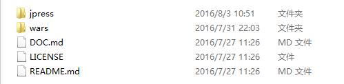
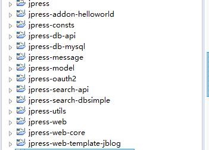
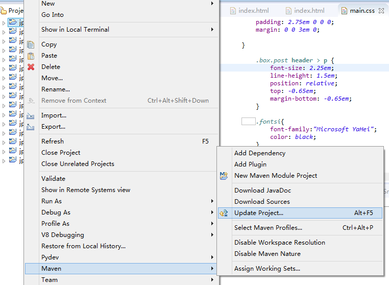
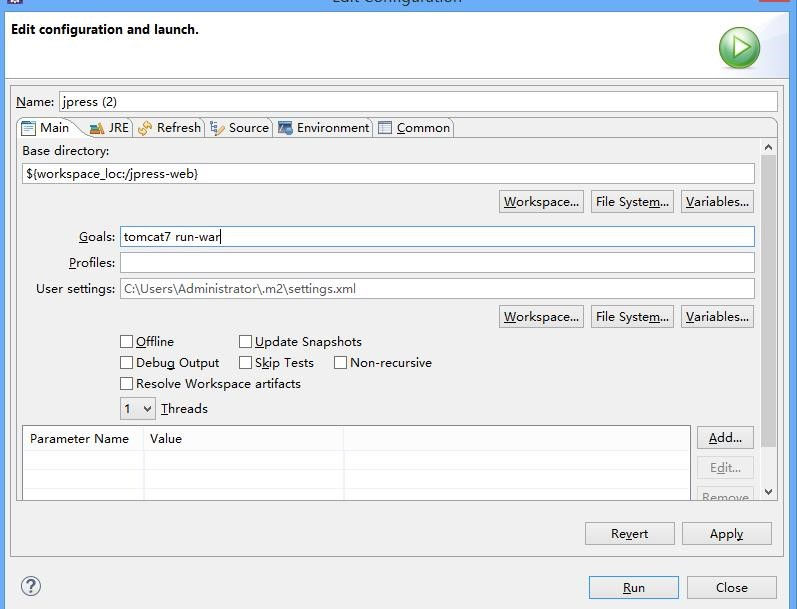
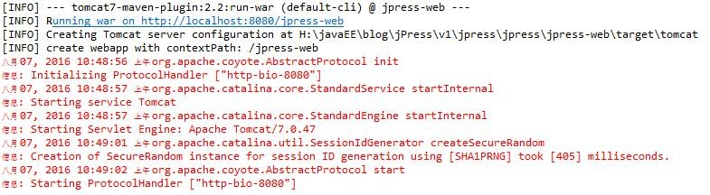
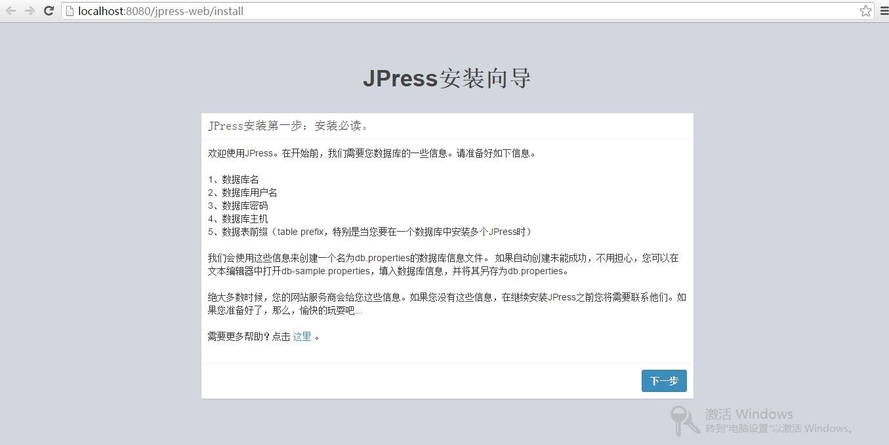
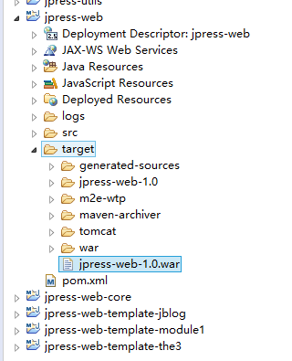

## Jpress的下载和部署
#### Jpress是最近刚发布的一款开源的java博客系统，十分轻量，方便，而且可以制作自己的模板。具体的内容参考：
http://www.oschina.net/news/75831/jpress-0-2-5

* 首先下载jpress的项目包，地址http://git.oschina.net/fuhai/jpress 你的电脑上需要安装有eclipse的maven环境。需要提前建好数据库。导入下面的jpress文件，按照maven project方式导入

<br>
<br>
<br>
* 导入之后目录结构是这样的：

<br>
<br>
<br>
* 最下面的jpress-web-template-jblog是一个模板文件，你也可以自己制作一个模板。海哥的网站里给出了制作模板的视频。然后更新maven项目，点击Update Project。

<br>
<br>
<br>
* 然后，运行maven install,安装成功后会有如下提示:
```
[INFO] Total time: 10.939 s
[INFO] Finished at: 2016-08-07T10:38:25+08:00
[INFO] Final Memory: 7M/121M
[INFO] ------------------------------------------------------------------------
```

* 接下来进行maven build配置<br>Name可以自己设定，点击Base directory下面的workspace，然后选择jpress-web项目，注意一定是选择jpress-web项目。然后在Goals 里输入 tomcat7 run-war。我使用的是tomcat7，也可以用 其他tomcat版本或者是使用jetty run-war。前提是你在pom文件里配置好了jetty。然后点击run  

<br>
<br>
<br>
* 出现了如下提示则说明运行成功

<br>
<br>
<br>
然后输入提示的地址： http://localhost:8080/jpress-web，web界面如下

<br><br><br>
* 说明一下，如果项目配置没有问题，在执行完maven install并且Build Success之后，会在如下的目录生成项目的war包

