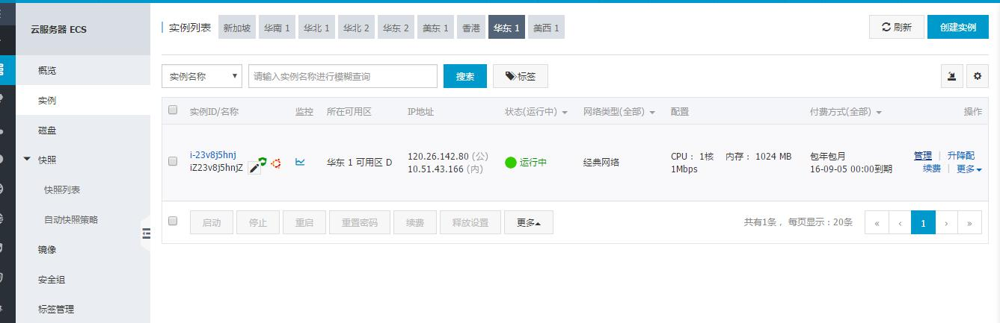
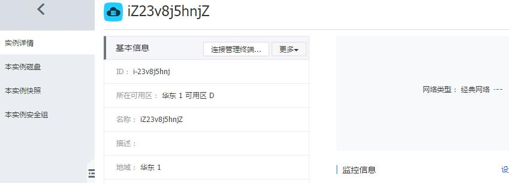
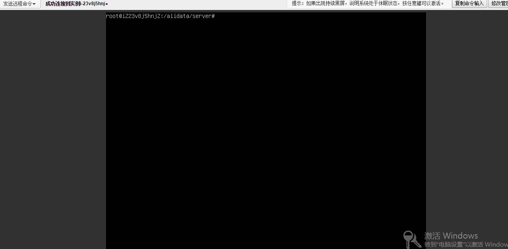

## jpress项目在阿里云上部署

#### 我在云服务上部署jpress的时候踩了很大的坑，首选不要选择新浪云，新浪云虽然一键上传war包很方便，但是jpress需要重启tomcat容器，而新浪云在终端关闭tomcat的时候会卡死。在界面重启容器则会丢失配置文件，导致项目不能正常运行。
 
#### 我买的是阿里云的云服务ECS,可以选择自带tomcat和mysql和java环境的云服务器。最好不要用nginx反向代理，因为他对动态web的支持不是很好。在研究Nginx配置的时候又陷入坑中，最后直接跳过nginx，使用tomcat进行配置。
 
#### 首先找到你购买的实例，然后点击管理。

 
#### 然后点击连接管理终端

 
#### 这里要注意，我们需要向终端上上传我们的项目文件，如果是windows系统，则需要Putty等远程连接的软件，我是直接用的Linux系统，可以使用ssh远程连接或者是scp 命令拷贝项目文件。
#### 在输入完管理终端密码后进入了终端控制台，（管理终端密码是6位数字，会在之前提示你设定，可以在更多选项里进行重置）

 
#### 要直接使用tomcat运行项目，需要先关闭nginx。在购买云服务时候会有一个说明文档，它的nginx和tomcat都使用了一个软连接,输入命令/etc/init.d/nginx stop，就让nginx停止运行了。
#### 然后将你的项目的war包上传上去，上传到的位置是在tomcat下的webapps路径，在上传之前，你可以测试一下tomcat是否能成功运行，输入/etc/init.d/tomcat7 start来启动tomcat，然后在浏览器输入ip+:8080,如果运行成功则会出现tomcat的一个初始界面，这个初始界面是在webapps下面的。
#### 测试成功之后，删除webapps下的所有文件，将你的war包放到这个目录，tomcat会自动打开你项目的war包。
#### 最后修改一下tomcat7/config/server.xml的文件，将里面的8080端口修改为80端口，这样做的目的是为了你可以直接输入你的域名地址或者是公网ip，而不用再加:8080就可以访问到你的web项目。然后重启tomcat，输入/etc/init.d/tomcat7 restart.
#### 最后在你的浏览器上输入服务器Ip地址。出现jpress的初始页面。接下来你就可以使用Jpress来建立自己的个人博客。
